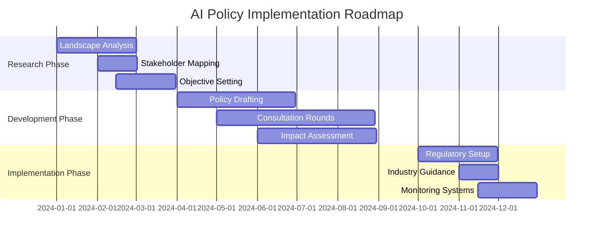

# Policymaker AI Intervention Guide

Design and implement effective AI policies for positive societal impact.

## Overview

This guide empowers policymakers to navigate the complex landscape of AI governance by providing a comprehensive framework for creating balanced regulations that foster innovation while protecting citizens. You'll learn to develop evidence-based policies that address AI's societal implications, engage diverse stakeholders effectively, and implement adaptive regulatory mechanisms that keep pace with technological change.

## Prerequisites

- Basic AI understanding
- Stakeholder access
- Policy-making authority
- Multi-disciplinary support

## Core Policy Framework

### Step 1: Understand the AI Landscape

Begin by conducting comprehensive research across three critical dimensions:

| **Technology Capabilities** | **Societal Impact** | **Global Context** |
|:---------------------------|:-------------------|:------------------|
| Current AI applications | Economic effects | International approaches |
| Emerging technologies | Employment changes | Competitive dynamics |
| Technical limitations | Privacy concerns | Cross-border issues |
| Future trajectories | Bias and fairness | Standards development |

### Step 2: Engage Stakeholders

Build inclusive consultation processes that incorporate diverse perspectives:

-   **Industry Representatives**

    ---

    - Tech companies
    - Traditional businesses
    - Startups
    - Industry associations

-   **Civil Society**

    ---

    - Privacy advocates
    - Ethics organizations
    - Consumer groups
    - Academic institutions

-   **Affected Communities**

    ---

    - Workers
    - Minorities
    - Vulnerable populations
    - General public

### Step 3: Define Policy Objectives

Balance multiple goals through a comprehensive framework:

| **Objective** | **Description** | **Key Metrics** |
|:-------------|:----------------|:----------------|
| **Innovation Promotion** | Foster AI development and adoption | Investment levels, startup growth |
| **Consumer Protection** | Safeguard against harmful AI uses | Complaint rates, harm incidents |
| **Economic Growth** | Enable competitive advantage | Productivity gains, market share |
| **Ethical Standards** | Ensure responsible AI deployment | Compliance rates, trust scores |
| **National Security** | Protect critical infrastructure | Threat assessments, resilience |
| **Privacy Preservation** | Maintain data protection rights | Breach incidents, access requests |

### Step 4: Develop Policy Framework

Create a multi-layered approach combining principles and risk assessment:

=== "Principles-Based Approach"

    | **Principle** | **Requirements** | **Implementation** |
    |:-------------|:-----------------|:-------------------|
    | **Transparency** | Explainable AI systems | Documentation standards |
    | **Accountability** | Clear responsibility chains | Liability frameworks |
    | **Fairness** | Non-discriminatory outcomes | Bias testing protocols |
    | **Privacy** | Data protection by design | Privacy impact assessments |
    | **Human Oversight** | Meaningful human control | Review mechanisms |

=== "Risk-Based Regulation"

    | **Risk Level** | **Applications** | **Regulatory Approach** |
    |:--------------|:-----------------|:------------------------|
    | **Minimal Risk** | Spam filters, games | Self-regulation |
    | **Limited Risk** | Chatbots, content moderation | Transparency obligations |
    | **High Risk** | Healthcare, hiring, law enforcement | Pre-market approval |
    | **Unacceptable Risk** | Social scoring, mass surveillance | Prohibition |

### Step 5: Design Implementation Mechanisms

Establish comprehensive regulatory infrastructure:

| **Regulatory Tools** | **Support Structures** |
|:-------------------|:---------------------|
| • Licensing requirements • Audit procedures • Certification programs • Compliance monitoring • Enforcement actions | • Advisory bodies • Technical standards • Best practices • Industry guidance • Public education |

### Step 6: Create Adaptive Policies

Build flexibility into your regulatory framework to ensure it remains relevant as technology evolves. Implement regular review cycles with defined triggers for updates, establish regulatory sandboxes for testing innovative applications, and create pilot programs that allow controlled experimentation before full-scale deployment.

### Step 7: Foster International Coordination

Collaborate on global governance initiatives:

| **Area** | **Focus** | **Mechanisms** |
|:---------|:----------|:---------------|
| **Standards** | Common technical requirements | ISO/IEC committees |
| **Data Flows** | Cross-border transfers | Adequacy decisions |
| **Enforcement** | Regulatory cooperation | Mutual recognition |
| **Ethics** | Shared principles | International forums |
| **Trade** | Market access | Trade agreements |

## Sector-Specific Regulations

??? details "Healthcare AI Regulations"

    ### Patient Safety Requirements
    - Clinical validation standards
    - Real-world performance monitoring
    - Adverse event reporting
    - Post-market surveillance

    ### Data Protection Measures
    - Enhanced consent procedures
    - De-identification standards
    - Access control requirements
    - Audit trail maintenance

    ### Liability Frameworks
    - Professional responsibility
    - Product liability coverage
    - Insurance requirements
    - Compensation mechanisms

??? details "Financial Services AI Rules"

    ### Fair Lending Practices
    - Non-discriminatory algorithms
    - Explainable credit decisions
    - Regular bias audits
    - Consumer recourse options

    ### Market Integrity
    - Manipulation prevention
    - Trading algorithm oversight
    - Systemic risk assessment
    - Circuit breaker mechanisms

    ### Consumer Protection
    - Clear disclosure requirements
    - Opt-out provisions
    - Data portability rights
    - Complaint procedures

??? details "Transportation AI Standards"

    ### Safety Requirements
    - Performance standards
    - Testing protocols
    - Certification processes
    - Incident reporting

    ### Liability Rules
    - Responsibility allocation
    - Insurance requirements
    - Compensation frameworks
    - Legal precedence

    ### Infrastructure Needs
    - Communication standards
    - Road infrastructure
    - Emergency protocols
    - Public safety integration

## Policy Implementation Tools

### Data Governance Framework

| **Aspect** | **Requirements** | **Enforcement** |
|:-----------|:----------------|:----------------|
| **Collection** | Purpose limitation, consent | Audits, penalties |
| **Use** | Specified purposes only | Access controls |
| **Sharing** | Data minimization | Contracts, monitoring |
| **Retention** | Time limits, deletion rights | Regular reviews |
| **Access** | Subject rights, portability | Response deadlines |

### Algorithm Accountability Measures

-   **Explainability**

    ---

    - Technical documentation
    - User-friendly explanations
    - Decision logic disclosure
    - Impact descriptions

-   **Testing Requirements**

    ---

    - Pre-deployment validation
    - Bias assessment
    - Performance metrics
    - Edge case analysis

-   **Ongoing Monitoring**

    ---

    - Continuous evaluation
    - Drift detection
    - Performance tracking
    - Incident analysis

## Labor Market Interventions

Create comprehensive support systems for workforce transitions:

| **Program Type** | **Components** | **Target Outcomes** |
|:----------------|:---------------|:-------------------|
| **Worker Protection** | Notification requirements, consultation rights | Fair transitions |
| **Retraining Programs** | Skills assessment, education funding | Career pivots |
| **Displacement Support** | Income support, job placement | Economic security |
| **Job Creation** | Innovation incentives, public programs | New opportunities |

## Best Practices

### 1. Evidence-Based Policy Development

Conduct thorough research before policy implementation, utilizing pilot programs to test approaches at smaller scales. Measure impacts systematically using predefined metrics and adjust policies based on empirical data rather than assumptions.

### 2. Inclusive Stakeholder Engagement

Design consultation processes that reach all affected groups, maintaining transparency throughout policy development. Establish regular communication channels and integrate feedback meaningfully into policy iterations.

### 3. Balanced Regulatory Approach

Strike an optimal balance between enabling innovation and mitigating risks. Maintain flexibility to adapt to technological changes while providing sufficient certainty for long-term planning and investment decisions.

## Common Pitfalls to Avoid

!!! warning "Regulatory Challenges"

    | **Pitfall** | **Consequences** | **Prevention Strategy** |
    |:------------|:-----------------|:----------------------|
    | **Over-regulation** | Innovation stifling, competitive disadvantage | Risk-based approach |
    | **Under-regulation** | Public harm, trust erosion | Proactive monitoring |
    | **Technology-specific rules** | Rapid obsolescence | Outcome-focused policies |
    | **Inflexible frameworks** | Inability to adapt | Built-in review cycles |
    | **Ignoring global context** | Regulatory arbitrage | International coordination |

## Measurement Framework

### Key Performance Indicators

=== "Innovation Metrics"

    | **Metric** | **Measurement** | **Target** |
    |:-----------|:----------------|:-----------|
    | AI Investment | Funding levels, R&D spending | Year-over-year growth |
    | Startup Activity | New company formation | Ecosystem vitality |
    | Patent Filings | AI-related patents | Innovation output |
    | Research Output | Publications, breakthroughs | Knowledge creation |

=== "Protection Metrics"

    | **Metric** | **Measurement** | **Target** |
    |:-----------|:----------------|:-----------|
    | Harm Incidents | Reported AI-related harms | Minimization |
    | Complaint Resolution | Time to resolution, satisfaction | Effective redress |
    | Compliance Rates | Audit results, violations | High adherence |
    | Public Trust | Survey data, confidence levels | Positive sentiment |

=== "Economic Impact"

    | **Metric** | **Measurement** | **Target** |
    |:-----------|:----------------|:-----------|
    | Employment Effects | Job creation vs displacement | Net positive |
    | Productivity Gains | Output per worker | Sustained growth |
    | Market Competition | Concentration indices | Healthy competition |
    | Export Performance | AI product/service exports | Global competitiveness |

## Implementation Timeline

## Resource Requirements

| **Human Resources** | **Technical Infrastructure** | **Financial Investment** |
|:-------------------|:---------------------------|:------------------------|
| • Expert advisors • Policy analysts • Legal teams • Technical specialists | • Research platforms • Consultation tools • Monitoring systems • Data analytics | • Stakeholder engagement • Research funding • Implementation costs • Ongoing operations |

## Next Steps

1. **Form Advisory Committee** - Assemble multi-disciplinary expertise
2. **Conduct Landscape Analysis** - Map current AI deployment and impacts
3. **Begin Stakeholder Engagement** - Initiate inclusive consultation process
4. **Review International Approaches** - Learn from global best practices
5. **Study [AI Adoption Barriers](../reference/ai-adoption-barriers.md)** - Understand implementation challenges

!!! success "Ready to Begin"
    With this comprehensive framework, you're equipped to develop AI policies that balance innovation with protection, creating a regulatory environment that serves both technological progress and societal well-being.