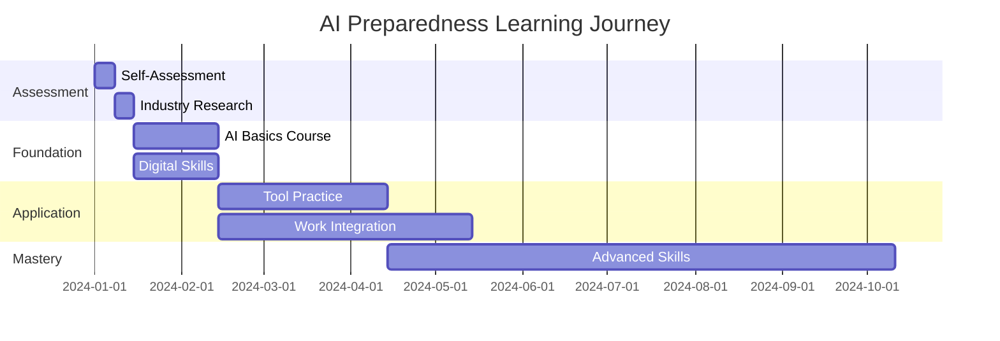

# Worker AI Preparedness Guide

Prepare for and thrive in an AI-augmented workplace.

## Overview

The rapid advancement of AI technology is transforming workplaces across every industry. This guide provides workers with a comprehensive framework to understand AI's impact on their careers, develop complementary skills that machines cannot replicate, adapt their work methods to leverage AI tools effectively, and secure their professional future in an increasingly automated world. Whether you're in a technical role or a creative position, this guide offers practical strategies to not just survive but thrive alongside AI.

## Prerequisites

| Requirement | Description | Getting Started |
|-------------|-------------|-----------------|
| **Openness to Change** | Willingness to adapt and learn new approaches | Start with small experiments |
| **Basic Digital Literacy** | Comfortable using computers and software | Take basic computer courses if needed |
| **Access to Learning Resources** | Internet connection and learning platforms | Many free resources available |
| **Time for Skill Development** | Dedicate regular time to learning | Start with 30 minutes daily |

## Skill Development Roadmap

### Core Competencies Matrix

| Skill Category | Foundation Level | Intermediate Level | Advanced Level |
|----------------|------------------|-------------------|----------------|
| **Critical Thinking** | Basic problem solving | Complex analysis | Strategic innovation |
| **AI Literacy** | Understanding AI basics | Using AI tools | Integrating AI workflows |
| **Communication** | Clear expression | Persuasive messaging | Leadership communication |
| **Data Skills** | Data interpretation | Basic analytics | Predictive insights |
| **Adaptability** | Accepting change | Driving change | Leading transformation |

### Learning Progression Timeline

## Steps

### 1. Understand AI's Role

Begin by developing a comprehensive understanding of how AI is transforming your specific field and industry.

#### Current AI Applications

| Industry Sector | Common AI Applications | Impact Level | Timeline |
|-----------------|------------------------|--------------|----------|
| **Administrative** | Document processing, scheduling, data entry | High | Now |
| **Creative** | Content generation, design assistance, editing | Medium | 1-2 years |
| **Customer Service** | Chatbots, ticket routing, basic inquiries | High | Now |
| **Healthcare** | Diagnostic assistance, record management | Medium | 2-5 years |
| **Manufacturing** | Quality control, predictive maintenance | High | Now |
| **Finance** | Risk assessment, fraud detection, reporting | High | Now |

### 2. Assess Your Position

#### Task Vulnerability Assessment Tool

| Task Type | Automation Risk | Mitigation Strategy | Timeline |
|-----------|-----------------|---------------------|----------|
| **Routine Data Entry** | 🔴 High | Learn data analysis | 0-2 years |
| **Creative Problem Solving** | 🟢 Low | Enhance with AI tools | 5+ years |
| **Customer Relationships** | 🟡 Medium | Focus on complex cases | 2-5 years |
| **Strategic Planning** | 🟢 Low | Integrate AI insights | 5+ years |
| **Physical Skilled Work** | 🟡 Medium | Learn robot collaboration | 2-5 years |

### 3. Develop AI-Complementary Skills

#### Human-AI Collaboration Framework

| Human Strengths | AI Strengths | Collaboration Approach |
|-----------------|--------------|------------------------|
| **Creativity & Innovation** | Pattern recognition | Use AI for inspiration, human for originality |
| **Emotional Intelligence** | Data processing | AI handles analytics, human manages relationships |
| **Ethical Judgment** | Computational power | Human sets guidelines, AI executes within bounds |
| **Complex Problem Solving** | Information retrieval | AI provides data, human connects dots |
| **Leadership & Vision** | Trend analysis | AI informs strategy, human sets direction |

### 4. Learn to Work with AI

#### AI Tool Proficiency Levels

| Level | Skills | Tools to Master | Certification Options |
|-------|--------|-----------------|----------------------|
| **Beginner** | Basic prompting, output review | ChatGPT, Claude | Google AI Essentials |
| **Intermediate** | Advanced prompting, workflow integration | Copilot, Jasper | IBM AI Fundamentals |
| **Advanced** | Custom solutions, API usage | AutoGPT, LangChain | Microsoft AI Engineer |
| **Expert** | AI system design, training | TensorFlow, PyTorch | Deep Learning Specialization |

### 5. Technical Skills Upgrade Path

#### Digital Skills Portfolio

| Skill Area | Essential Tools | Learning Resources | Practice Projects |
|------------|----------------|-------------------|-------------------|
| **Data Literacy** | Excel, Tableau, Power BI | DataCamp, Khan Academy | Analyze workplace data |
| **AI Interaction** | ChatGPT, Claude, Copilot | OpenAI tutorials, Anthropic docs | Automate daily tasks |
| **Digital Communication** | Slack, Teams, Zoom | LinkedIn Learning | Lead virtual meetings |
| **Cybersecurity** | Password managers, VPNs | SANS Cyber Aces | Security audit |
| **Automation** | Zapier, Make, IFTTT | Official documentation | Create workflow automations |

## Industry-Specific Guidance

??? info "Administrative & Office Roles"
    ### Transformation Focus Areas
    
    | Current Task | AI Enhancement | New Role Focus |
    |--------------|----------------|----------------|
    | Data entry | Automated extraction | Data quality & insights |
    | Scheduling | AI calendar management | Strategic planning |
    | Report writing | AI-assisted drafting | Analysis & recommendations |
    | File management | Intelligent organization | Knowledge curation |
    
    ### Recommended Learning Path
    1. **Month 1-2**: Master AI writing assistants
    2. **Month 3-4**: Learn data visualization tools
    3. **Month 5-6**: Develop project management skills
    4. **Ongoing**: Build industry expertise
    
    ### Success Metrics
    - Automate 50% of routine tasks
    - Increase strategic work by 30%
    - Complete 2 AI certifications
    - Lead 1 process improvement project

??? info "Creative Professionals"
    ### AI as Creative Partner
    
    | Creative Domain | AI Tools | Human Value-Add |
    |-----------------|----------|-----------------|
    | Writing | Jasper, Copy.ai | Voice, storytelling, emotion |
    | Design | Midjourney, DALL-E | Concept, taste, client vision |
    | Music | AIVA, Soundraw | Composition, performance, soul |
    | Video | Runway, Synthesia | Direction, narrative, authenticity |
    
    ### Skill Development Priority
    1. **Technical**: Prompt engineering for creative tools
    2. **Artistic**: Develop unique style AI can't replicate
    3. **Business**: Client relationship management
    4. **Ethical**: AI disclosure and authenticity
    
    ### Portfolio Evolution
    - Showcase AI-augmented projects
    - Highlight human creative process
    - Document unique methodologies
    - Build thought leadership

??? info "Customer Service Representatives"
    ### Evolving Service Roles
    
    | Service Level | AI Handles | Human Handles |
    |---------------|------------|---------------|
    | Tier 1 | FAQs, password resets | None - fully automated |
    | Tier 2 | Basic troubleshooting | Complex problems, empathy |
    | Tier 3 | Knowledge retrieval | Expert solutions, relationships |
    | Tier 4 | Data analysis | Strategic accounts, innovation |
    
    ### Upskilling Priorities
    1. **Emotional Intelligence**: De-escalation, empathy training
    2. **Technical Depth**: Product expertise beyond scripts
    3. **Problem Solving**: Root cause analysis
    4. **Relationship Building**: Account management skills
    
    ### Career Progression
    - Customer Success Manager
    - Technical Support Specialist
    - Client Relationship Manager
    - Service Innovation Lead

??? info "Healthcare Workers"
    ### AI Integration in Healthcare
    
    | Role | AI Applications | Enhanced Responsibilities |
    |------|-----------------|--------------------------|
    | Nurses | Monitoring alerts, documentation | Patient advocacy, complex care |
    | Doctors | Diagnostic assistance, treatment options | Difficult cases, patient communication |
    | Administrators | Scheduling, billing | Patient experience, efficiency |
    | Technicians | Image analysis, lab automation | Quality control, special procedures |
    
    ### Certification Pathways
    1. **Clinical Informatics** - 6 months
    2. **Healthcare Data Analytics** - 3 months
    3. **AI in Medicine** - 4 months
    4. **Digital Health Leadership** - 12 months
    
    ### Ethical Considerations
    - Patient privacy with AI systems
    - Maintaining human touch
    - AI bias in healthcare
    - Decision accountability

??? info "Manufacturing & Skilled Trades"
    ### Industry 4.0 Transition
    
    | Traditional Skill | Digital Enhancement | Future Role |
    |-------------------|---------------------|-------------|
    | Machine Operation | IoT monitoring | Systems optimization |
    | Quality Inspection | Computer vision | Exception handling |
    | Maintenance | Predictive analytics | Complex repairs |
    | Assembly | Collaborative robots | Process improvement |
    
    ### Technical Certifications
    1. **Robotics Safety** - OSHA/RIA
    2. **Industrial IoT** - Cisco/Microsoft
    3. **Predictive Maintenance** - IBM/GE
    4. **Digital Manufacturing** - SME/AME
    
    ### Hands-On Learning
    - Shadow automation engineers
    - Join digital transformation teams
    - Participate in kaizen events
    - Lead pilot programs

## Learning Resources Hub

### Online Learning Platforms

| Platform | Best For | Price Range | Notable Features |
|----------|----------|-------------|------------------|
| **Coursera** | University courses | Free-$79/month | Certificates, degrees |
| **LinkedIn Learning** | Professional skills | $30/month | Career paths |
| **Udacity** | Tech skills | $399/month | Nanodegrees |
| **edX** | Academic learning | Free-$300/course | MicroMasters |
| **Pluralsight** | IT/Developer | $29/month | Skill assessments |
| **DataCamp** | Data science | $25/month | Interactive coding |

### AI Tools for Practice

| Tool | Primary Use | Free Tier | Learning Curve |
|------|-------------|-----------|----------------|
| **ChatGPT** | General AI assistant | Yes (Limited) | 🟢 Easy |
| **Claude** | Advanced reasoning | Yes (Limited) | 🟢 Easy |
| **GitHub Copilot** | Code assistance | No ($10/month) | 🟡 Medium |
| **Midjourney** | Image generation | No ($10/month) | 🟡 Medium |
| **Jasper** | Content creation | No ($40/month) | 🟢 Easy |
| **Runway** | Video AI | Limited | 🔴 Advanced |

### Professional Communities

| Community Type | Platform Options | Benefits | Time Investment |
|----------------|------------------|----------|-----------------|
| **Industry Forums** | Reddit, Discord | Peer learning, trends | 30 min/day |
| **Local Meetups** | Meetup.com, Eventbrite | Networking, hands-on | 2-4 hours/month |
| **Online Courses** | Cohort-based courses | Structured learning | 5-10 hours/week |
| **Professional Associations** | Industry-specific | Certifications, standards | Varies |

## Success Measurement Framework

### Progress Tracking Dashboard

| Milestone | 30 Days | 60 Days | 90 Days | 6 Months |
|-----------|---------|---------|---------|----------|
| **AI Tool Proficiency** | Basic usage | Daily integration | Advanced features | Teaching others |
| **Skill Development** | 1 course completed | 2-3 courses | First certification | Specialized expertise |
| **Work Integration** | Pilot project | Regular use | Process improvement | Leading innovation |
| **Network Growth** | Join 2 communities | Active participation | Thought leadership | Mentoring others |

### Key Performance Indicators

1. **Efficiency Gains**: Track time saved through AI adoption
2. **Skill Certifications**: Document completed training
3. **Project Impact**: Measure value created
4. **Career Advancement**: Monitor role evolution

## Action Planning Toolkit

### 90-Day Quick Start Plan

??? example "Week 1-2: Foundation"
    - [ ] Complete comprehensive self-assessment
    - [ ] Research AI impact in your industry
    - [ ] Join 2 relevant online communities
    - [ ] Set up learning schedule (30 min/day)
    
    **Success Metric**: Clear understanding of current position

??? example "Week 3-4: Exploration"
    - [ ] Try 3 different AI tools
    - [ ] Complete intro AI course
    - [ ] Identify 3 high-impact skills to develop
    - [ ] Connect with 5 professionals in your field
    
    **Success Metric**: Hands-on AI experience

??? example "Month 2: Application"
    - [ ] Integrate 1 AI tool into daily work
    - [ ] Start intermediate skill course
    - [ ] Propose AI pilot project at work
    - [ ] Document learnings and share
    
    **Success Metric**: Practical implementation

??? example "Month 3: Advancement"
    - [ ] Lead AI adoption initiative
    - [ ] Complete first certification
    - [ ] Mentor colleague on AI tools
    - [ ] Plan next learning phase
    
    **Success Metric**: Demonstrated expertise

## Overcoming Common Challenges

### Resistance Management Strategies

| Challenge | Root Cause | Solution Approach | Success Story |
|-----------|------------|-------------------|---------------|
| **Fear of Replacement** | Uncertainty | Focus on augmentation | "I became the AI expert in my team" |
| **Technical Intimidation** | Skill gap | Start with user-friendly tools | "ChatGPT made me confident" |
| **Time Constraints** | Competing priorities | Micro-learning approach | "15 minutes daily changed everything" |
| **Organizational Resistance** | Culture | Become change champion | "I led our digital transformation" |

## Next Steps

1. **Immediate Actions** (Today)
   - Bookmark this guide for reference
   - Take the task vulnerability assessment
   - Sign up for one AI tool

2. **This Week**
   - Complete industry research
   - Join one learning community
   - Set 90-day goals

3. **This Month**
   - Start first AI course
   - Experiment with 3 tools
   - Share learnings with colleagues

4. **Ongoing**
   - Review [AI Adoption Statistics](../reference/ai-adoption-statistics.md)
   - Update skills quarterly
   - Contribute to community knowledge

---

*Remember: The goal isn't to compete with AI, but to become irreplaceable by combining human strengths with AI capabilities. Your experience, creativity, and judgment paired with AI's computational power create unmatched value.*